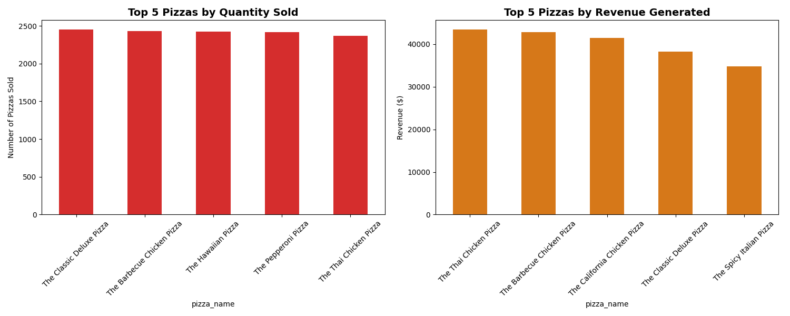
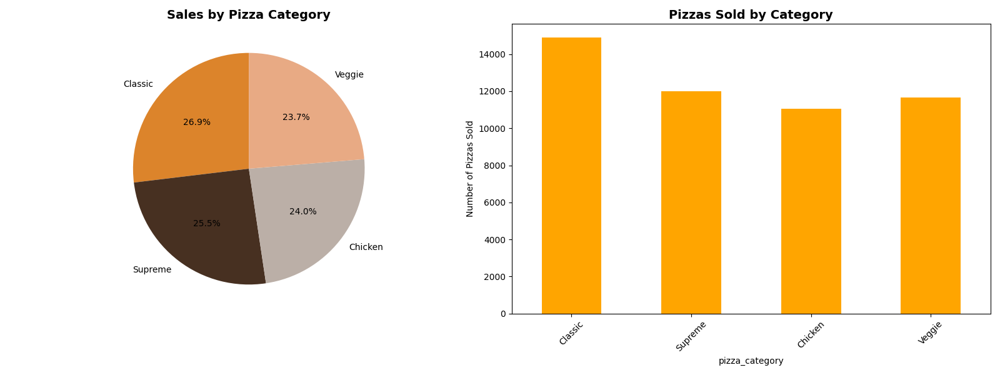
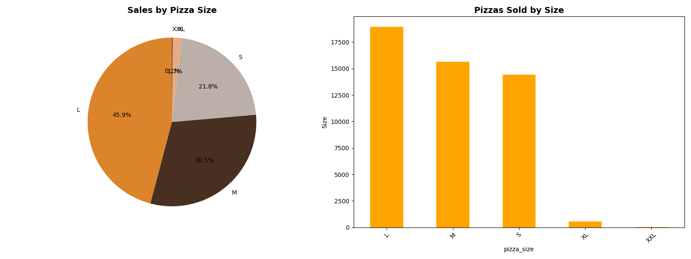
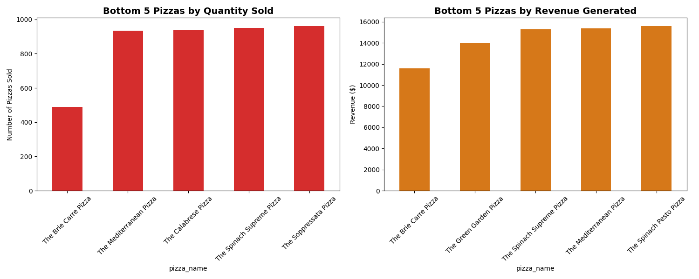
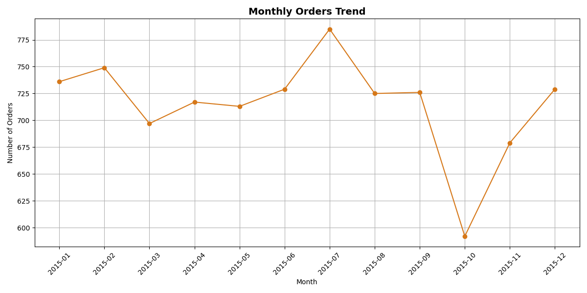
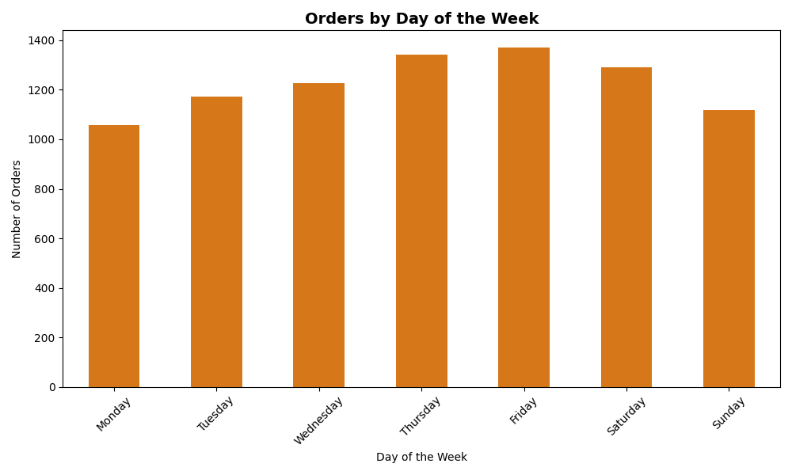
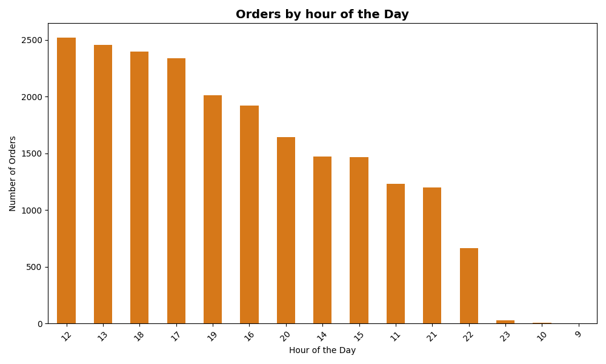

# 🍕 Pizza Sales Analysis  

## 📌 Project Overview  
This project explores **pizza sales data** to uncover insights into sales performance, customer preferences, and time-based trends. The goal is to apply **Python for data cleaning, exploratory data analysis (EDA), and visualization**, providing actionable insights for menu optimization, promotions, inventory management, and staffing.  

---

## 🎯 Problem Statement 
Pizza restaurants generate huge amounts of transactional data every day, but without proper analysis, valuable insights into customer preferences, product performance, and sales trends remain hidden. Management often struggles with questions like:

- Which pizzas should be promoted more aggressively?
- Are certain menu items underperforming and costing more to keep than they bring in?
- How do sales patterns change across days, months, or hours, and how can staffing or marketing be optimized around these trends?
- Does the price of a pizza influence how often it gets ordered?

This project addresses these challenges by analyzing pizza sales data to uncover trends in product performance, customer demand, and time-based sales patterns. By answering these questions, the analysis provides a data-driven foundation for:

1. Menu optimization → identifying best-sellers and low performers
2. Marketing strategies → targeting promotions based on popular pizzas and peak times
3. Operational efficiency → planning staff schedules around busy periods

The ultimate goal is to transform raw sales data into actionable insights that support smarter business decisions, increase revenue, and improve customer satisfaction. 

### 🗂️ Dataset
Source: https://www.kaggle.com/datasets/nextmillionaire/pizza-sales-dataset/data 

This dataset contain detailed information about pizza orders, including specifics about the pizza variants, quantities, pricing, dates, times, and categorization details.
- pizza_id: A unique identifier assigned to each distinct pizza variant available for ordering.
- order_id: A unique identifier for each order made, which links to multiple pizzas.
- pizza_name_id: An identifier linking to a specific name of the pizza.
- quantity: The number of units of a specific pizza variant ordered within an order.
- order_date: The date when the order was placed.
- order_time: The time when the order was placed.
- unit_price: The cost of a single unit of the specific pizza variant.
- total_price: The aggregated cost of all units of a specific pizza variant in an order.
- pizza_size: Represents the size of the pizza (e.g., small, medium, large).
- pizza_category: Indicates the category of the pizza, such as vegetarian, non-vegetarian, etc.
- pizza_ingredients: Provides a list or description of the ingredients used in the pizza.
- pizza_name: Specifies the name of the specific pizza variant ordered.

### 1. Sales Performance & Product Analysis  
**Objective:**  
To understand which pizzas are the most and least popular and profitable, enabling data-driven decisions on:  
- Menu optimization  
- Promotions and marketing  
- Inventory management  

**Key Questions & Insights:**  

#### 🔝 Top 5 Best-Selling Pizzas (by Quantity)  
| Pizza Name                | Quantity | Revenue ($) |
|----------------------------|----------|-------------|
| The Classic Deluxe Pizza   | 2453     | 38,180.50   |
| The Barbecue Chicken Pizza | 2432     | 42,768.00   |
| The Hawaiian Pizza         | 2422     | 32,273.25   |
| The Pepperoni Pizza        | 2418     | 30,161.75   |
| The Thai Chicken Pizza     | 2371     | 43,434.25   |

#### 💰 Top 5 Best-Selling Pizzas by Revenue  
| Pizza Name                 | Quantity | Revenue ($) |
|-----------------------------|----------|-------------|
| The Thai Chicken Pizza      | 2371     | 43,434.25   |
| The Barbecue Chicken Pizza  | 2432     | 42,768.00   |
| The California Chicken Pizza| 2370     | 41,409.50   |
| The Classic Deluxe Pizza    | 2453     | 38,180.50   |
| The Spicy Italian Pizza     | 1924     | 34,831.25   |

#### 📦 Category Sales Contribution  
- **Classic Pizzas:** $220,053.10 (highest)  
- **Veggie Pizzas:** $193,690.00 (lowest)  

#### 📏 Pizza Sizes in Demand  
- **Most Popular:** Large (L) — $375,318.00 in sales  
- **Least Popular:** XXL — $1,006.00 in sales  

#### ⬇️ Bottom 5 Worst-Selling Pizzas (by Quantity)  
| Pizza Name                | Quantity | Revenue ($) |
|----------------------------|----------|-------------|
| The Brie Carre Pizza       | 490      | 11,588.50   |
| The Mediterranean Pizza    | 934      | 15,360.50   |
| The Calabrese Pizza        | 937      | 15,934.25   |
| The Spinach Supreme Pizza  | 950      | 15,277.75   |
| The Soppressata Pizza      | 961      | 16,425.75   |

#### 💸 Bottom 5 Worst-Selling Pizzas by Revenue  
| Pizza Name                | Quantity | Revenue ($) |
|----------------------------|----------|-------------|
| The Brie Carre Pizza       | 490      | 11,588.50   |
| The Green Garden Pizza     | 997      | 13,955.75   |
| The Spinach Supreme Pizza  | 950      | 15,277.75   |
| The Mediterranean Pizza    | 934      | 15,360.50   |
| The Spinach Pesto Pizza    | 970      | 15,596.00   |

#### 📉 Correlation Between Price & Popularity  
- Correlation coefficient: **-0.31**  
- Interpretation: Moderate **negative relationship** — as price increases, pizza sales quantity tends to decrease.  

---

### 2. Time-Based Trend Analysis  
**Objective:**  
To identify **sales patterns across time** (monthly, weekly, hourly) in order to optimize:  
- Staffing schedules  
- Marketing campaigns  
- Preparation for peak demand periods  

**Key Questions & Insights:**  

#### Sales trends on a monthly basis
- 📅 **Best Month:** July 2015 — **785 orders**  
- 📅 **Worst Month:** October 2015 — **592 orders**  

#### Orders by Days of the Week
- 🗓️ **Busiest Day:** Friday — **1371 orders**  
- 🗓️ **Slowest Day:** Monday — **1056 orders**  

#### Busiest Hour of the Day
- ⏰ **Busiest Hour:** 12:00 PM — **2520 orders**  

---

## ⚙️ Tools & Technologies  
- **Python** (pandas, numpy, matplotlib, seaborn)  
- **Jupyter Notebook** for analysis  
- **Git/GitHub** for version control  

---

## Key Findings
## 💡 Business Insights  

1. **Promote Best-Selling Pizzas**  
   - Pizzas like *Thai Chicken*, *Barbecue Chicken*, and *Classic Deluxe* consistently drive high sales and revenue.  
   - These pizzas should be prioritized in **marketing campaigns, meal bundles, and loyalty programs** to maximize profitability.  

2. **Reevaluate Low-Performing Pizzas**  
   - Pizzas such as *Brie Carre* and *Spinach Supreme* generate minimal sales.  
   - They may be considered for **menu removal** or targeted **niche promotions** to reduce costs and simplify inventory.  

3. **Optimize Inventory Management**  
   - The **Classic pizza category** contributes the most to revenue, meaning ingredients like cheese, pepperoni, and tomato sauce should be prioritized in supply chain planning.  
   - **Veggie pizzas** sell the least, indicating a risk of ingredient overstock and waste.  

4. **Align Product Strategy with Size Preferences**  
   - **Large pizzas** are the most popular, while **XXL pizzas** perform poorly.  
   - Phasing out XXL sizes (or running limited-time XXL promotions) could help optimize resources and menu design.  

5. **Adjust Pricing Strategy**  
   - The **negative correlation (-0.31)** between price and popularity suggests that higher prices reduce sales volumes.  
   - **Revisiting pricing tiers**—especially for mid-range pizzas—could encourage more frequent purchases and boost total revenue.  

6. **Leverage Time-Based Trends**  
   - **Fridays** and **lunchtime (12 PM)** are peak sales periods.  
   - Businesses should:  
     - Schedule **additional staff** during these times to meet demand.  
     - Run **lunchtime specials** or **Friday promotions** to capitalize on customer behavior.  

7. **Plan for Seasonal Demand**  
   - **July** recorded the highest orders, while **October** had the lowest.  
   - Restaurants can balance demand with **seasonal campaigns** (e.g., summer family deals, fall-themed promotions).  

## 🚀 Next Steps / Future Improvements  
- Expand analysis with **SQL queries** for deeper insights  
- Create an **interactive dashboard** (Tableau or Power BI)  
- Automate monthly sales reports using Python scripts  
